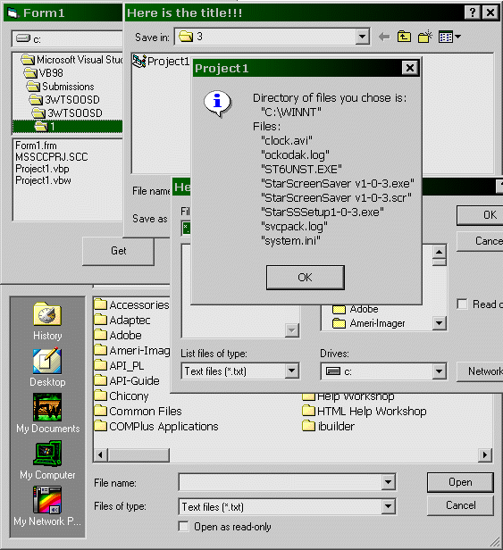



## TWTSOOSD \- Three ways to show open or save dialog \(without CommonDialog control\)

### Description

Viewing this code you can learn how to show (without CommonDialog control and using default system dlls) three kinds of open and save dialogs (see the screenshot!!!). The dialogs may look like in old programs from win95 or like in VB or like in Notepad or Wordpad. One way uses three controls and 2nd and 3rd ways use API functions. This code also shows how to open files in multi mode (open more than one file). The zip file is small and every line is commented. Vote or leave a comment if you want and if this code will help you!
 
### More Info
 

             |
---                |---
**Submitted On**   |2003-08-29 23:38:36
**By**             |[Filip Wielewski](https://github.com/Planet-Source-Code/PSCIndex/blob/master/ByAuthor/filip-wielewski.md)
**Level**          |Intermediate
**User Rating**    |4.5 (18 globes from 4 users)
**Compatibility**  |VB 6\.0
**Category**       |[Coding Standards](https://github.com/Planet-Source-Code/PSCIndex/blob/master/ByCategory/coding-standards__1-43.md)
**World**          |[Visual Basic](https://github.com/Planet-Source-Code/PSCIndex/blob/master/ByWorld/visual-basic.md)
**Archive File**   |[TWTSOOSD\_\-1637528302003\.zip](https://github.com/Planet-Source-Code/filip-wielewski-twtsoosd-three-ways-to-show-open-or-save-dialog-without-commondialog-contr__1-48087/archive/master.zip)

